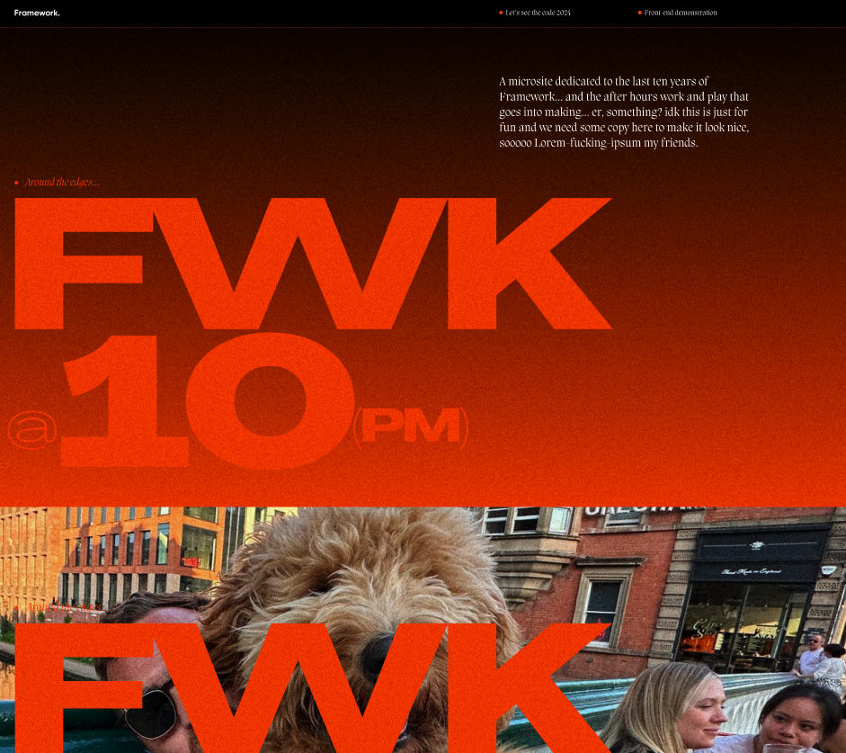

# Weareframework

This is the repo for the lets the code project that we are going to build over the next few months.

Our aim is to keep this open, fun, engaging, experimental and to encourage everyone to feel comfortable in taking part and keeping the code as the star.

Good code allows us to push ourselves to bring more complex and creative designs to life.
We pride ourselves in creativity, innovation, and collaboration to solve problems with unique and creative solutions.

Your ideas, big or small, matter.

If you have an idea or a suggestion, please speak to us in the discord chat via the link tree link here https://linktr.ee/letsseethecode

## What are we going to build?

Our lead designer, Jim (well known for his love of purple) has created a microsite for us to build, so we can share our process for creating frontend-heavy sites with lots of animations

We wanted to showcase something that shows what framework is and what we do well.

The code is the star (of course), but so are the designs.
The design is in figma but here is what we are going to build:


We wanted to showcase something that shows what Framework is and what we do well.
Type heavy, scroll journey, lots of fun

## What technologies are going to use?

We are going to utilise the following to build this:

- Html
- Javascript
- Tailwind
- GSAP

## How long will it take?

It takes as long as it takes.

Projects with deadlines are part and parcel of agency day to day but this project is meant to be fun for everyone.

So we will take the time to do it.

All PRs are welcome and we want anyone who gets involved to take the time to learn and enjoy learning. Ask questions

## I want to get involed, Who do I speak to?

Alana Bishop, James Rowe & Paul Quinn are the developers to speak to.
We are in the discord chat and happy to talk to anyone about this project

## How can I get this project working locally?

This is a simple project setup using Laravel Mix and Tailwind CSS with just HTML, CSS, and JavaScript.

1.  Clone the repository to your local machine:
2.  Install the project dependencies

    ```npm install

    ```

3.  Compile assets (HTML, CSS, and JavaScript) using Laravel Mix.
    :

        ```
        npx mix
        ```

4.  Start the local development server:

    ```
    npx mix watch
    ```

    This command starts the Laravel Mix development server and watches your files for changes. You can access your project at `http://localhost:8888`.
